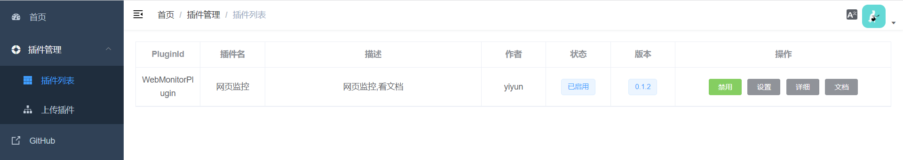
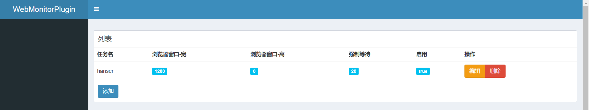
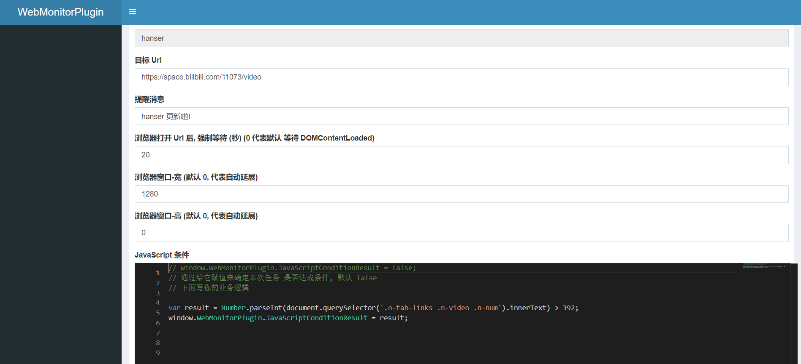
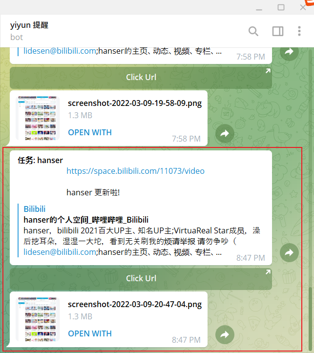

<h1 align="center">Dragonfly</h1>

> ASP.NET Core + Selenium 实现 Web 自动化平台

[]()
[](https://github.com/yiyungent/Dragonfly/blob/main/LICENSE)
[](https://jq.qq.com/?_wv=1027&k=q5R82fYN)

## Introduce


ASP.NET Core + Selenium 实现 Web 自动化平台

> **应用场景:**
> - 自动签到等
> - 监控网页变化, 及时提醒
> - 运行 WebUI 自动化测试
> - 爬虫, 数据采集
> - 一切可用浏览器完成的操作，都可自动化运行

- **开箱即用** - 完全打包好的 `Selenium` 环境
- **易扩展** - 集成 `PluginCore`, 插件化架构

> **注意** : **WebMonitorPlugin** 已可在新平台 [KnifeHub](https://github.com/yiyungent/KnifeHub) 可用, 所有功能已完成移植, 本项目 **Dragonfly** 正式归档, 停止开发!

> **注意** : **WebMonitorPlugin** 已可在新平台 [KnifeHub](https://github.com/yiyungent/KnifeHub) 可用, 所有功能已完成移植, 本项目 **Dragonfly** 正式归档, 停止开发!

> **注意** : **WebMonitorPlugin** 已可在新平台 [KnifeHub](https://github.com/yiyungent/KnifeHub) 可用, 所有功能已完成移植, 本项目 **Dragonfly** 正式归档, 停止开发!


## Screenshots

### 插件管理: PluginCore Admin




### 插件: WebMonitorPlugin

> 可用于 网页监控，以达到 开播，商品降价，新活动，稿件更新，新歌曲 提醒




> Telegram 通知, 还会附加一张网页截图




## Quick Start

> 部署完成后访问: <https://yourdomain/PluginCore/Admin>    

> 插件:   
> 下载插件包, 然后直接 `上传 -> 安装 -> 文档 -> 设置 -> 启用 -> 文档` 即可


### 方式1: 使用 Railway 免费 一键部署 

[](https://railway.app/new/template?code=JQuUBW&referralCode=8eKBDA)


#### Railway 环境变量

| 环境变量名称                | 必填 | 备注                    |
| --------------------------- | ---- | ----------------------- |
| `PLUGINCORE_ADMIN_USERNAME` | √    | PluginCore Admin 用户名 |
| `PLUGINCORE_ADMIN_PASSWORD` | √    | PluginCore Admin 密码   |


> 注意: Railway 重新 Deploy 后会删除数据, 你安装的所有插件及数据都将清空。

### 方式2: 使用 Heroku 免费 一键部署

[](https://heroku.com/deploy?template=https://github.com/yiyungent/Dragonfly)

#### Heroku 环境变量

| 环境变量名称                | 必填 | 备注                    |
| --------------------------- | ---- | ----------------------- |
| `PLUGINCORE_ADMIN_USERNAME` | √    | PluginCore Admin 用户名 |
| `PLUGINCORE_ADMIN_PASSWORD` | √    | PluginCore Admin 密码   |


### 方式3: 使用 Docker

```bash
# 获取源代码: 方式1: ssh 
git clone git@github.com:yiyungent/Dragonfly.git
# 获取源代码: 方式2: https 
git clone https://github.com/yiyungent/Dragonfly.git

cd Dragonfly

docker build -t yiyungent/dragonfly -f src/WebApi/Dockerfile .

docker run -d -p 5004:80 -e ASPNETCORE_URLS="http://*:80" --shm-size="500m" --name dragonfly yiyungent/dragonfly
```


## 插件开发

> 注意:  
> 所有纯基于 `PluginCore.IPlugins` 开发的插件都通用,   
> 下载插件包, 然后 `上传 -> 安装 -> 设置 -> 启用` 即可


> 插件开发 可参考:   
> - [插件开发 | PluginCore](https://moeci.com/PluginCore/zh/PluginDev/Guide/)

> Dragonfly 插件开发包  
> 插件开发包中已包含:   
> - `Selenium.WebDriver`
> - `PluginCore.IPlugins`

```powershell
dotnet add package Dragonfly.Sdk
```


## 相关项目


- [yiyungent/WebScreenshot](https://github.com/yiyungent/WebScreenshot)
- [yiyungent/PluginCore](https://github.com/yiyungent/PluginCore)


## Donate

Dragonfly is an MIT licensed open source project and completely free to use. However, the amount of effort needed to maintain and develop new features for the project is not sustainable without proper financial backing.

We accept donations through these channels:

- <a href="https://afdian.net/@yiyun" target="_blank">爱发电</a> (￥5.00 起)
- <a href="https://dun.mianbaoduo.com/@yiyun" target="_blank">面包多</a> (￥1.00 起)

## Author

**Dragonfly** © [yiyun](https://github.com/yiyungent), Released under the [MIT](./LICENSE) License.<br>
Authored and maintained by yiyun with help from contributors ([list](https://github.com/yiyungent/Dragonfly/contributors)).

> GitHub [@yiyungent](https://github.com/yiyungent) Gitee [@yiyungent](https://gitee.com/yiyungent)

